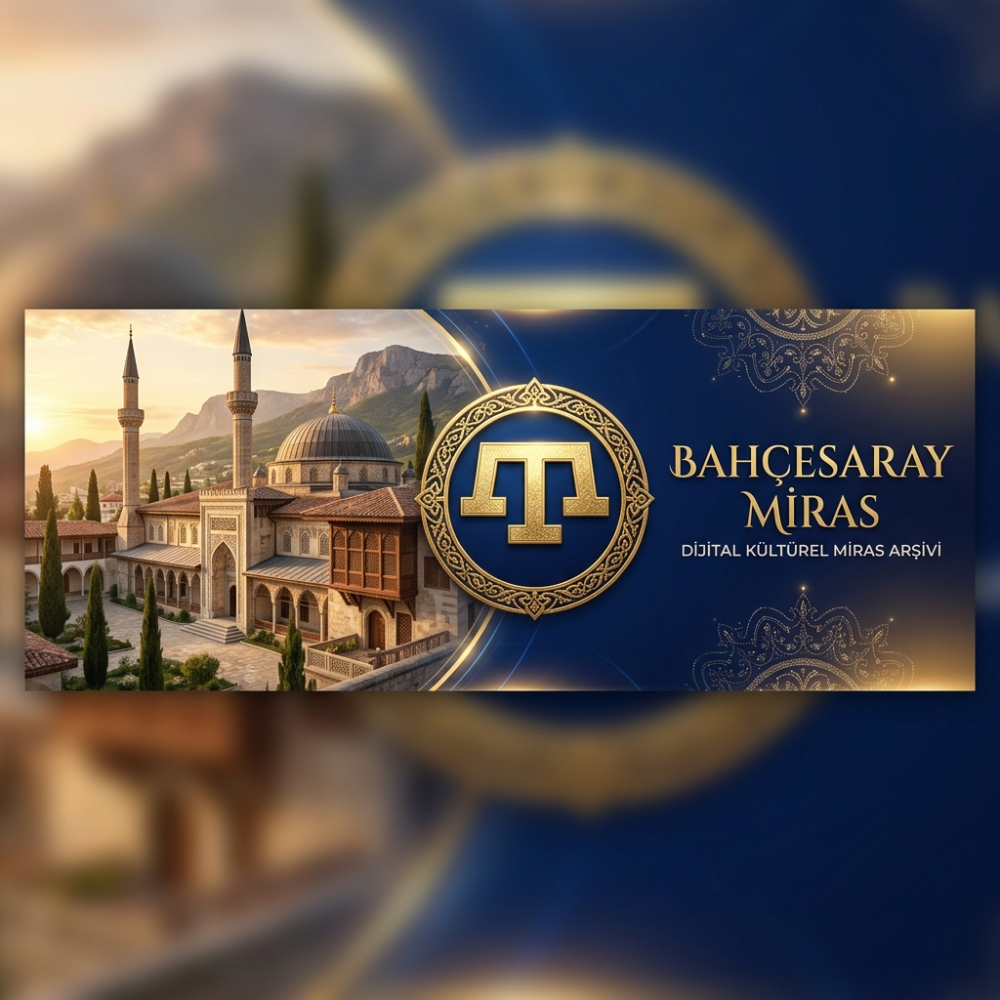

<p align="center">
  
</p>

# 🕌 Bahçesaray Miras: Kırım Tatar Dijital Kültür Arşivi ve Portalı

🌐 **[İnteraktif Dijital Kültür Portalı'nı Keşfedin!](https://arch-yunus.github.io/Bahcesaray-Miras/)**
*(Şiirleri satır satır çevirileriyle karşılaştırın, kültür öncülerinin biyografilerine göz atın ve NLP tabanlı canlı kelime analizcimizi tarayıcınızda deneyimleyin!)*

> *"Ant etkenmen, söz bergenmen millet içün ölmege, / Bilip, körip milletimniñ köz yaşını silmege..."*
> — **Numan Çelebicihan** (Kırım Tatar Milli Marşı / Ant Etkenmen)

> *"Kırım – bizim yeşil beşik, / Altın saray, nurlu eşik."*
> — **Amdi Giraybay** (Kırımım)

> *"Tuvğan yerim, seni terk etip ketsem de, cüregimniñ yarısı sende qaldı."*
> — **Bekir Sıtkı Çoban-zade** (Kırım Şiirleri)

Bahçesaray Miras; Kırım Tatar halkının yüzyıllar boyunca ilmek ilmek işlediği zengin kültürel mirasını, edebi eserlerini, sanatını, sözlü halk folklorunu, mimarisini ve tarihi dokusunu dijital dünyada ölümsüzleştirmeyi hedefleyen açık kaynaklı bir araştırma, koruma ve dijital hafıza deposudur. Bu platform, sürgünler ve baskılarla yok edilmeye çalışılan bir halkın kültürel belleğini modern bilişim araçlarıyla geleceğe taşımak için kurgulanmıştır.

---

## 📌 İçindekiler

1. [📖 Vizyon ve Kapsam](#-vizyon-ve-kapsam)
2. [🗂️ Depo Mimarisi ve Dizin Yapısı](#%EF%B8%8F-depo-mimarisi-ve-dizin-yapısı)
3. [🏛️ Tarih ve Kültürel Miras Detayları](#%EF%B8%8F-tarih-ve-kültürel-miras-detayları)
   - [⏳ Kırım Hanlığı Dönemi](#-kırım-hanlığı-dönemi)
   - [🥀 18 Mayıs 1944 Sürgünü](#-18-mayıs-1944-sürgünü)
   - [🔱 Semboller ve Geleneksel El Sanatları](#-semboller-ve-geleneksel-el-sanatları)
   - [🎵 Sözlü Folklor ve Müzik](#-sözlü-folklor-ve-müzik)
4. [📊 Veri Setleri ve Geliştirici Kılavuzu](#-veri-setleri-ve-geliştirici-kılavuzu)
   - [📂 JSON Veri Şemaları](#-json-veri-şemaları)
   - [⚙️ Senkronizasyon Betiği](#%EF%B8%8F-senkronizasyon-betiği)
   - [🐍 İleri Seviye Python Entegrasyonları](#-i̇leri-seviye-python-entegrasyonları)
5. [🖥️ İnteraktif Web Portalı Teknik Mimarisi](#%EF%B8%8F-i̇nteraktif-web-portalı-teknik-mimarisi)
   - [⚙️ Yerel Çalıştırma Kılavuzu](#%EF%B8%8F-yerel-çalıştırma-kılavuzu)
   - [🚀 CI/CD ve Yayınlama Süreci](#-cicd-ve-yayınlama-süreci)
6. [🚀 Yol Haritası (Roadmap)](#-yol-haritası-roadmap)
7. [🤝 Katkı Sağlama Rehberi (Contributing)](#-katkı-sağlama-rehberi-contributing)
8. [✒️ Kültür Hazinesinden Seçkin Alıntılar](#%EF%B8%8F-kültür-hazinesinden-seçkin-alıntılar)
9. [📚 Akademik Referanslar ve Kaynakça](#-akademik-referanslar-ve-kaynakça)
10. [📜 Lisans](#-lisans)

---

## 📖 Vizyon ve Kapsam

> *"Milletlerin kalbi edebiyattır, edebiyatsız millet dilsiz insana benzer."*
> — **İsmail Gaspıralı** (Edebi Makaleler)

İsmail Gaspıralı'nın *"Dilde, fikirde, işte birlik"* şiarından aldığımız ilhamla, Kırım Tatar edebi metinlerini, sanatsal formlarını, geleneksel el sanatlarını ve mitolojik unsurları dijital ortamda bir araya getiriyoruz. Projenin ana hedefleri şunlardır:

* 🎓 **Akademik Araştırmacılar İçin:** Doğrulanmış kaynaklara ve akademik referanslara dayanan tarihi, edebi ve kültürel metinlere hızlı, yapılandırılmış ve ücretsiz erişim sağlamak.
* 💻 **Yazılım Geliştiricileri İçin:** Kırım Tatar dili, morfolojisi ve kültürü üzerine yapılacak Doğal Dil İşleme (NLP), Yapay Zeka (AI) ve Makine Öğrenmesi (ML) projeleri için hazır yapılandırılmış (JSON/CSV) veri setleri sunmak.
* 🏺 **Kültür Elçileri ve Topluluk İçin:** Geleneksel sanatların, destanların, yırların, çıñların ve unutulmaya yüz tutmuş halk adetlerinin dijital ekosistemde yaşatılmasını ve genç nesillere aktarılmasını sağlamak.

---

## 🗂️ Depo Mimarisi ve Dizin Yapısı

Proje dosyaları, modüler ve geliştirici dostu bir yapıda organize edilmiştir. Aşağıdaki dizin ağacında projenin güncel hiyerarşik yapısı yer almaktadır:

```
Bahcesaray-Miras/
├── .github/                  # GitHub Actions CI/CD iş akışları
├── Edebiyat/                 # Edebiyat arşivi
│   ├── Biyografiler/        # Kültür öncülerinin yaşam öyküleri
│   ├── Destanlar/           # Yazıya geçirilmiş halk destanları
│   ├── Siirler/             # Orijinal ve Türkçe çevirili şiirler
│   ├── Tercuman_Gazetesi/   # İsmail Gaspıralı dönemi yayınları
│   ├── Edebi_Alintilar.md   # Seçkin mısralar koleksiyonu
│   └── README.md
├── Mitoloji_ve_Folklor/      # Efsaneler, masallar ve halk inançları
├── Multimedya/               # Multimedya varlıkları
│   └── Gorsel_Arsiv/        # Proje görsel varlıkları ve banner'lar
├── Sanat_ve_Zanaat/          # Geleneksel sanatlar ve mimari incelemeler
│   ├── Mimari/              # Hansaray vb. tarihi eser mimari detayları
│   └── Tarak_Tamga/         # Sembolik köken analizleri
├── Tarih_ve_Surgun/          # Tarihi belgeler ve araştırmalar
│   ├── Hanlik_Donemi/       # Kırım Hanlığı dönemi
│   └── Surgun_1944/         # Sürgünlik tarihi vesikaları
├── Veri_Setleri/             # Geliştiriciler için veri setleri
│   ├── CSV/                 # CSV formatlı tablolar
│   └── JSON/                # JSON formatlı yapılandırılmış veriler
├── scripts/                  # Yardımcı otomasyon betikleri
│   └── sync_data.py         # JSON'dan CSV'ye veri senkronizasyonu
├── index.html                # İnteraktif Portal ana arayüzü
├── style.css                 # Arayüz tasarım stilleri (Glassmorphism)
├── app.js                    # Portalın istemci tarafındaki ana mantığı
└── README.md                 # Proje ana tanıtım belgesi
```

---

## 🏛️ Tarih ve Kültürel Miras Detayları

### ⏳ Kırım Hanlığı Dönemi (1441 - 1783)
Cengiz Han soyundan gelen Giray Hanedanı tarafından kurulan Kırım Hanlığı, Karadeniz'in kuzeyinde yüzyıllar boyunca egemenliğini sürdürmüştür. Osmanlı İmparatorluğu ile kurduğu özel askeri ve diplomatik ittifak sayesinde Doğu Avrupa politikasında kritik rol oynamıştır. Bahçesaray, Akmescit, Gözleve ve Karasubazar gibi kentler; medreseleri, sarayları, hanları ve kütüphaneleriyle İslam medeniyetinin kuzeydeki en önemli entelektüel merkezleri haline gelmiştir. Bu zengin dönem, 1783 yılında Rus Çarlığı tarafından gerçekleştirilen ilhakla son bulmuştur.

### 🥀 18 Mayıs 1944 Sürgünü (Sürgünlik)
Stalin rejimi tarafından "kolektif ihanet" iddiasıyla suçlanan yaklaşık 200 bin Kırım Tatarı, tek bir gecede (18 Mayıs 1944) vatanlarından koparılarak tren vagonlarına doldurulmuş ve Özbekistan, Kazakistan ile Sibirya'ya sürgün edilmiştir. Yolculuk esnasındaki gayriinsani şartlar ve sürgün bölgelerindeki ağır zorunlu çalışma koşulları sebebiyle nüfusun yaklaşık %46'sı ilk yıllarda hayatını kaybetmiştir. Kırım Tatarları, dünyada benzeri az görülen barışçıl insan hakları mücadeleleri sayesinde 1989 yılından itibaren vatanlarına geri dönmeye başlayabilmişlerdir.

### 🔱 Semboller ve Geleneksel El Sanatları
* **Tarak-Tamga:** Mengli Giray Han döneminden bu yana Kırım Tatar egemenliğinin sembolü olan bu üç dişli arma, teraziyi (adalet ve dengeyi) simgeler. Günümüzde gök mavisi zeminli milli bayrağın üzerinde altın sarısı rengiyle yer alır.
* **Kuyumculuk ve Telkari:** İnce gümüş veya altın tellerin bükülerek işlenmesiyle yapılan telkari sanatı, Kırım Tatar kadınlarının geleneksel takılarında (kuşak, göğüslük) doruk noktasına ulaşmıştır.
* **Tatar İşlemesi (Nakış):** Altın ve gümüş ipliklerle kadife veya ipek kumaş üzerine yapılan geleneksel işlemeler, bitkisel motifler (öşek, gül vb.) içerir ve her motifin kendine özgü sembolik bir anlamı vardır.

### 🎵 Sözlü Folklor ve Müzik
* **Yırlar ve Çıñlar:** Kırım Tatar halk edebiyatında melodik şarkılara *yır*, irticali (doğaçlama) olarak söylenen ikişer satırlık kafiyeli manilere ise *çıñ* denir. Çıñlar, düğünlerde ve şenliklerde atışma şeklinde söylenir.
* **Halk Çalgıları:** Dümbelek, keman, zurna ve geleneksel bir üflemeli çalgı olan kaval Kırım Tatar ezgilerinin temelini oluşturur.

---

## 📊 Veri Setleri ve Geliştirici Kılavuzu

Depomuzdaki verilerin yazılım projelerinde kolayca kullanılabilmesi amacıyla yapılandırılmış veri setleri sunuyoruz.

### 📂 JSON Veri Şemaları

#### 1. Şiirler Veri Seti (`siirler.json`)
Her şiir kaydı aşağıdaki JSON şemasına uygun olarak saklanır:
```json
{
  "type": "array",
  "items": {
    "type": "object",
    "properties": {
      "id": { "type": "string", "description": "Benzersiz tanımlayıcı (ör: ant_etkenmen)" },
      "baslik": { "type": "string", "description": "Kırım Tatarca başlık" },
      "turkce_baslik": { "type": "string", "description": "Türkiye Türkçesi başlık" },
      "yazar": { "type": "string", "description": "Şairin adı ve soyadı" },
      "yil": { "type": "integer", "description": "Yazım veya yayın yılı" },
      "tur": { "type": "string", "description": "Eserin türü (Şiir, Destan vb.)" },
      "orijinal_metin": {
        "type": "array",
        "items": { "type": "string" },
        "description": "Kırım Tatarca mısralar dizisi"
      },
      "turkce_tercume": {
        "type": "array",
        "items": { "type": "string" },
        "description": "Eş zamanlı mısra bazlı Türkçe tercüme dizisi"
      }
    },
    "required": ["id", "baslik", "yazar", "yil", "tur", "orijinal_metin", "turkce_tercume"]
  }
}
```

#### 2. Yazarlar Veri Seti (`yazarlar.json`)
Yazarların biyografik bilgileri şu şema ile sunulmaktadır:
```json
{
  "type": "array",
  "items": {
    "type": "object",
    "properties": {
      "ad": { "type": "string", "description": "Yazarın adı ve soyadı" },
      "dogum_yili": { "type": "integer", "description": "Doğum yılı" },
      "olum_yili": { "type": "integer", "description": "Ölüm yılı" },
      "dogum_yeri": { "type": "string", "description": "Doğum yeri" },
      "unvan": { "type": "string", "description": "Mesleki ve edebi unvanları" },
      "ana_eserler": {
        "type": "array",
        "items": { "type": "string" },
        "description": "En bilinen başyapıtları"
      },
      "hakkinda": { "type": "string", "description": "Detaylı biyografik özet" }
    },
    "required": ["ad", "dogum_yili", "olum_yili", "dogum_yeri", "unvan", "ana_eserler", "hakkinda"]
  }
}
```

### ⚙️ Senkronizasyon Betiği

JSON formatındaki veriler üzerinde düzenleme yapıldıktan sonra, bu verileri tablosal analizlere uygun CSV biçimine dönüştürmek için projedeki Python otomasyon scriptini çalıştırabilirsiniz:

```bash
python scripts/sync_data.py
```

Bu script, `Veri_Setleri/JSON/` altındaki dosyaları okur, doğrular ve `Veri_Setleri/CSV/` altındaki karşılık gelen CSV dosyalarını otomatik olarak günceller.

### 🐍 İleri Seviye Python Entegrasyonları

#### Örnek 1: Şiirlerde Kelime Frekansı Analizi
```python
import json
import collections
import re

# Şiir veri setini yükle
with open("Veri_Setleri/JSON/siirler.json", "r", encoding="utf-8") as f:
    siirler = json.load(f)

# Tüm orijinal mısraları birleştir
tum_metin = ""
for siir in siirler:
    tum_metin += " ".join(siir["orijinal_metin"]) + " "

# Kelimeleri temizle ve ayır
kelimeler = re.findall(r'\b\w+\b', tum_metin.lower())

# En sık geçen 10 kelimeyi bul
kelime_sayilari = collections.Counter(kelimeler)
print("--- En Sık Geçen 10 Kelime ---")
for kelime, frekans in kelime_sayilari.most_common(10):
    print(f"{kelime}: {frekans} kez")
```

#### Örnek 2: Şiir ve Yazar Eşleştirmeli Arama Modülü
```python
import json

def yazar_eserlerini_bul(yazar_adi):
    with open("Veri_Setleri/JSON/siirler.json", "r", encoding="utf-8") as f:
        siirler = json.load(f)
    
    yazar_siirleri = [s for s in siirler if yazar_adi.lower() in s["yazar"].lower()]
    
    print(f"\n=== {yazar_adi} Eserleri ({len(yazar_siirleri)} adet) ===")
    for s in yazar_siirleri:
        print(f"- {s['baslik']} ({s['yil']}) - Tür: {s['tur']}")

yazar_eserlerini_bul("İsmail Bey Gaspıralı")
yazar_eserlerini_bul("Bekir Sıtkı Çoban-zade")
```

---

## 🖥️ İnteraktif Web Portalı Teknik Mimarisi

Kırım Tatar kültürel verilerini son kullanıcıya çekici bir tasarımla sunmak üzere geliştirilen portal, bir Tek Sayfa Uygulaması (SPA) olarak kurgulanmıştır.

* **Arayüz Tasarımı:** Google Fonts (Outfit & Playfair Display) tipografisi kullanılarak, modern cam efekti (**Glassmorphism**) ve yumuşak geçişli arka plan gradyanları ile tasarlanmıştır. CSS Custom Properties sayesinde tüm renk şeması modülerdir.
* **Performans:** İstemci tarafında çalışan (Client-Side Rendering) Vanilla JavaScript yapısı sayesinde harici hiçbir büyük JS framework'üne (React, Vue vb.) ihtiyaç duymaz, anında yüklenir ve yüksek SEO skoru sağlar.
* **NLP & Arama:** Kullanıcı yazmaya başladığı anda tüm şiirlerde, yazarlarda ve tarihi makalelerde istemci düzeyinde anlık kelime eşleşmesi sağlayan yerleşik bir arama motoru içerir.

### ⚙️ Yerel Çalıştırma Kılavuzu

Portalı kendi bilgisayarınızda yerel olarak çalıştırmak ve üzerinde değişiklik yapmak oldukça basittir:

1. Projeyi bilgisayarınıza klonlayın:
   ```bash
   git clone https://github.com/arch-yunus/Bahcesaray-Miras.git
   cd Bahcesaray-Miras
   ```
2. Tarayıcıların güvenlik kısıtlamaları (CORS) nedeniyle JSON dosyalarının yerel olarak okunabilmesi için projeyi bir yerel web sunucusu ile çalıştırmanız gerekir. Terminalden aşağıdaki komutlardan birini çalıştırın:
   * **Python 3 ile:**
     ```bash
     python -m http.server 8000
     ```
   * **Node.js (http-server) ile:**
     ```bash
     npx http-server -p 8000
     ```
3. Tarayıcınızdan `http://localhost:8000` adresine gidin.

### 🚀 CI/CD ve Yayınlama Süreci

Proje, ana dala (`main`) gönderilen her başarılı güncellemeden sonra otomatik olarak çalışan bir GitHub Actions iş akışına sahiptir. Bu iş akışı:
1. Kod kalitesini denetler.
2. Web portalını derleyerek doğrudan GitHub Pages üzerinden yayına alır: **[https://arch-yunus.github.io/Bahcesaray-Miras/](https://arch-yunus.github.io/Bahcesaray-Miras/)**

---

## 🚀 Yol Haritası (Roadmap)

* [x] **Faz 1:** Depo mimarisinin kurgulanması, açık kaynak vizyonunun duyurulması ve tanıtım banner'larının tasarlanması.
* [x] **Faz 2:** Temel edebi eserlerin, destanların, yazar biyografilerinin ve ilk şiir metinlerinin depoya eklenmesi.
* [x] **Faz 3:** İnteraktif Dijital Kültür Portalı web arayüzünün (SPA) geliştirilmesi, dil analiz aracının eklenmesi ve otomatik GitHub Pages CI/CD entegrasyonu.
* [ ] **Faz 4:** Arşivin topluluk katkılarıyla genişletilmesi, sözlü tarih derlemelerinin eklenmesi ve verilerin açık bir "Kültür API" altyapısına dönüştürülmesi.
* [ ] **Faz 5:** Sesli yır/çıñ kayıtları için konuşma tanıma (Speech-to-Text) modellerinin entegrasyonu ve Tercüman Gazetesi arşivinin OCR ile dijitalleştirilmesi.

---

## 🤝 Katkı Sağlama Rehberi (Contributing)

Bu arşiv, Kırım Tatar halkının kolektif hafızasıdır. Yeni belgeler eklemek, tarihi metinleri transkript etmek veya var olan araştırmaları zenginleştirmek için herkesin katkısına açıktır:

1. Depoyu **"Fork"**layın.
2. Üzerinde çalışacağınız konuya uygun yeni bir dal (branch) oluşturun: `git checkout -b kultur/CoraBatirDestani`
3. Katkı kurallarına dikkat ederek değişikliklerinizi yapın:
   * **Edebi Metin Standartları:** Kırım Tatarca Latin Alfabesi yazım kurallarına riayet edilmeli, mısralar satır satır çevirileriyle eşleştirilmelidir.
   * **Akademik Referans:** Eklenen her tarihi makale ve biyografi güvenilir kaynaklarla desteklenmeli, kaynakça eklenmelidir.
4. Değişikliklerinizi anlamlı bir mesajla **"Commit"**leyin: `git commit -m 'Eklenti: Çora Batır destanının Kırım Tatarca orijinal metni eklendi'`
5. Dalınıza **"Push"**layın: `git push origin kultur/CoraBatirDestani`
6. Bir **"Pull Request (PR)"** başlatın ve incelememizi bekleyin.

---

## ✒️ Kültür Hazinesinden Seçkin Alıntılar

| Yazar / Şair | Alıntı | Eser / Kaynak |
| :--- | :--- | :--- |
| **Numan Çelebicihan** | *"Ant etkenmen, söz bergenmen millet içün ölmege, / Bilip, körip milletimniñ köz yaşını silmege..."* | *Ant Etkenmen* |
| **İsmail Gaspıralı** | *"Milletlerin kalbi edebiyattır, edebiyatsız millet dilsiz insana benzer."* | *Edebi Yazılar* |
| **Bekir Çoban-zade** | *"Seniñ içün, tuvğan tilim, neler yapmam, neler etmem! / Seniñ içün, tuvğan tilim, kerek olsa, canım berem!"* | *Tuvğan Til* |
| **Cengiz Dağcı** | *"Vatan, insanın çocukluğudur; ilk gördüğü gökyüzü, ilk bastığı topraktır."* | *Korkunç Yıllar* |
| **Amdi Giraybay** | *"Tuvğan tilni unutmañız, o Kırım'nın bağıdır, / Kim ki tilini unuttı, vatanından ayrıdır."* | *Yiğitlerge* |
| **Eşref Şemi-zade** | *"Közyaş Divarı'nın taşları dile gelse, Kırım'ın çektiği çileleri dağlar taşlar taşıyamazdı."* | *Közyaş Divarı* |
| **Şakir Selim** | *"Kırım demek – yeşil beşik demektir, / Kırım demek – ana sütü demektir."* | *Kırım* |
| **Aşık Ümer** | *"Al yeşil giyinip süslenip çıksın, / Gözleve'nin güzel elâ gözlüsü."* | *Gözleve Koşması* |

---

## 📚 Akademik Referanslar ve Kaynakça

Projedeki tarihi ve kültürel bilgiler aşağıdaki temel akademik kaynaklar temel alınarak derlenmiştir:

1. **İnalcık, Halil** (2010). *Kırım Hanlığı Tarihi Araştırmaları*. İstanbul: Türkiye İş Bankası Kültür Yayınları.
2. **Fisher, Alan W.** (1978). *The Crimean Tatars*. Stanford: Hoover Institution Press.
3. **Gaspıralı, İsmail** (2003). *Dilde, Fikirde, İşte Birlik (Seçme Eserleri)*. Haz. Hakan Kırımlı. Ankara: TİKA Yayınları.
4. **Çoban-zade, Bekir** (1927). *Kırım Tatar Edebiyatı Tarihi Dersleri*. Akmescit.
5. **Kırımlı, Hakan** (1996). *National Movements and National Identity Among the Crimean Tatars (1905-1916)*. Leiden: E.J. Brill.

---

## 📜 Lisans

Bu proje [MIT Lisansı](https://opensource.org/licenses/MIT) altında lisanslanmıştır. Bilginin ve kültürün özgürce paylaşılmasını, bilimsel araştırmalarda kullanılmasını ve korunmasını destekliyoruz.